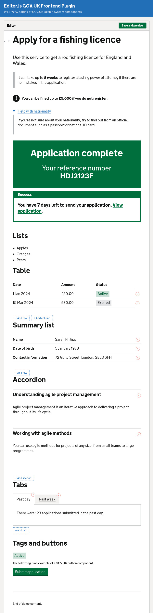

# @vitriltd/editor-js-govuk-frontend

Editor.js block tools that render GOV.UK Design System components.

[Live demo](https://vitriltd.github.io/editor-js-govuk-frontend/)

## Features

- 15 block tools covering core GOV.UK Design System components
- 2 inline tools (Tag, Visually Hidden)
- WYSIWYG editing with contentEditable
- Export to GOV.UK Frontend HTML using precompiled Nunjucks — zero runtime compiler dependency
- Clean Editor.js JSON storage
- TypeScript with full type exports

## Use cases

- **CMS for government services** — let content editors build pages that output standards-compliant GOV.UK Frontend HTML, without writing markup by hand
- **Prototyping** — quickly assemble GOV.UK-styled page content during service design and user research
- **Internal tools** — back-office applications that need to produce citizen-facing GOV.UK pages
- **Documentation and guidance** — author structured guidance content with proper GOV.UK components (details, warning text, inset text, etc.)

## Installation

```sh
npm install @vitriltd/editor-js-govuk-frontend @editorjs/editorjs
```

Requires `@editorjs/editorjs` v2.x as a peer dependency.

The plugin emits **GOV.UK Frontend v6** markup. Your application is responsible for
loading matching GOV.UK Frontend v6 CSS, JavaScript and assets (fonts and images) —
for example from the [`govuk-frontend`](https://www.npmjs.com/package/govuk-frontend)
package, which is declared as an optional peer dependency.

> Upgrading from a pre-1.0 release? GOV.UK Frontend v6 renamed some Tag colours.
> Run your saved documents through the migration tool to bring them up to date —
> see [MIGRATIONS.md](./MIGRATIONS.md).

## Quick start

```ts
import EditorJS from '@editorjs/editorjs'
import { govukTools } from '@vitriltd/editor-js-govuk-frontend'
import '@vitriltd/editor-js-govuk-frontend/dist/editor-overrides.css'

const editor = new EditorJS({
  holder: 'editorjs',
  tools: govukTools(),
})
```

## Security

`renderToHtml()` / `migrate()` produce **raw HTML** that includes the rich-text content authored in the editor (bold, links, inline tags, etc.). This is by design — it's what makes the output render as real GOV.UK components.

**If your content authors are not fully trusted, or saved JSON can reach the renderer from an untrusted source, sanitise the output before inserting it into the DOM** — for example with [DOMPurify](https://github.com/cure53/DOMPurify):

```ts
import DOMPurify from 'dompurify'
container.innerHTML = DOMPurify.sanitize(renderToHtml(data))
```

The library applies defence-in-depth — structural fields (sizes, list styles) are allow-listed, and `javascript:`/`data:` href schemes are stripped — and the editor tools set Editor.js `sanitize` configs. **These are not a substitute for sanitising untrusted output** (they don't, for example, decode HTML-entity-encoded payloads or strip event-handler attributes). When authors are trusted (e.g. an authenticated internal CMS), no extra sanitisation is required.

## Configuration

`govukTools()` accepts an options object to control which components are enabled and to pass per-component config:

```ts
const editor = new EditorJS({
  holder: 'editorjs',
  tools: govukTools({
    // Only enable specific components
    components: ['heading', 'paragraph', 'list', 'inset-text'],

    // Per-component config (keyed by component slug)
    heading: { levels: [1, 2, 3] },
  }),
})
```

Omit `components` to enable all block tools.

## Components

### Block tools

| Component | Tool name | GOV.UK component |
| --- | --- | --- |
| Heading | `heading` | [Heading](https://design-system.service.gov.uk/styles/headings/) |
| Paragraph | `paragraph` | [Paragraph](https://design-system.service.gov.uk/styles/paragraphs/) |
| List | `list` | [List](https://design-system.service.gov.uk/styles/lists/) |
| Inset text | `inset-text` | [Inset text](https://design-system.service.gov.uk/components/inset-text/) |
| Warning text | `warning-text` | [Warning text](https://design-system.service.gov.uk/components/warning-text/) |
| Details | `details` | [Details](https://design-system.service.gov.uk/components/details/) |
| Panel | `panel` | [Panel](https://design-system.service.gov.uk/components/panel/) |
| Notification banner | `notification-banner` | [Notification banner](https://design-system.service.gov.uk/components/notification-banner/) |
| Table | `table` | [Table](https://design-system.service.gov.uk/components/table/) |
| Summary list | `summary-list` | [Summary list](https://design-system.service.gov.uk/components/summary-list/) |
| Accordion | `accordion` | [Accordion](https://design-system.service.gov.uk/components/accordion/) |
| Tabs | `tabs` | [Tabs](https://design-system.service.gov.uk/components/tabs/) |
| Tag | `tag` | [Tag](https://design-system.service.gov.uk/components/tag/) |
| Button | `button` | [Button](https://design-system.service.gov.uk/components/button/) |
| Section break | `section-break` | [Section break](https://design-system.service.gov.uk/styles/section-break/) |

### Inline tools

| Tool | Description |
| --- | --- |
| Tag | Wrap selected text in a GOV.UK tag |
| Visually Hidden | Mark selected text as visually hidden |

## Exporting HTML

Convert Editor.js JSON to GOV.UK Frontend HTML:

```ts
import { renderToHtml, saveWithHtml } from '@vitriltd/editor-js-govuk-frontend'

// Option 1: render from saved data
const data = await editor.save()
const html = renderToHtml(data)

// Option 2: save and render in one step
const output = await saveWithHtml(editor)
console.log(output.renderedHtml)
```

`saveWithHtml()` returns the standard Editor.js output data with a `renderedHtml` property appended.

## Advanced usage

### Individual tool imports

For manual Editor.js configuration without the `govukTools()` helper:

```ts
import { GovukHeading, GovukParagraph, GovukList } from '@vitriltd/editor-js-govuk-frontend'

const editor = new EditorJS({
  holder: 'editorjs',
  tools: {
    heading: { class: GovukHeading },
    paragraph: { class: GovukParagraph, inlineToolbar: true },
    list: { class: GovukList },
  },
})
```

### Rendering individual components

Use `renderComponent()` to render a single GOV.UK component from macro params:

```ts
import { renderComponent } from '@vitriltd/editor-js-govuk-frontend'

const html = renderComponent('warning-text', {
  text: 'You can be fined up to £5,000.',
  iconFallbackText: 'Warning',
})
```

### Custom tools

Extend `GovukBlockTool` to create your own Editor.js block tools that follow the same patterns:

```ts
import { GovukBlockTool } from '@vitriltd/editor-js-govuk-frontend'
```

## Development

```sh
npm install
npm run dev       # Dev server with demo at localhost:3000
npm run build     # Production build
npm test          # Run tests
```

Templates from `govuk-frontend` are precompiled at build time (`npm run precompile`), so the published package has no dependency on the Nunjucks compiler at runtime.



## Licence

MIT — [Vitri Ltd](https://vitri.ltd)
